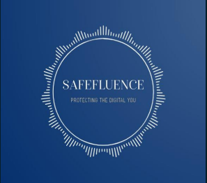

### SAFEFLUENCE_LLC

  

## 1. Account Recovery Services 

SafeFluence will assist clients in recovering hacked accounts on platforms like YouTube, Instagram, Facebook, and Twitter by: Acting as a liaison between the client and the respective platform.  
Ensuring account restoration is handled securely and promptly.

# How It Works:
Clients report the hack through SafeFluence's platform.  
Our team collaborates directly with the platform's support teams to resolve the issue.  
All processes adhere to strict cybersecurity standards, ensuring data safety.  

## 2. Legal Support via Subscription- Based Credits 

Hire lawyers for disputes on social media platforms, such as defamation, copyright issues, or account bans.  
Cover initial legal consultation or filing fees. 

# How It Works:
Clients receive legal credits based on their subscription tier (e.g., Basic, Pro, Premium).  
SafeFluence partners with a network of legal professionals experienced in digital disputes.  
Clients can redeem credits for legal services, and SafeFluence manages the referral process.  

# Example Subscription Tiers 
1. Basic Plan:  
Features: Limited account recovery support, 5 legal credits/month.  
2. Pro Plan:  
Features: Priority recovery support, 15 legal credits/month.  
3. Premium Plan:  
Features: Dedicated support, 30 legal credits/ month, plus additional perks.  

# Why This Matters 
1. Rising Cyber Threats: Hacked accounts are increasingly common, and users need reliable recovery options.  
2. Digital Legal Protection: Most users and influencers lack affordable access to legal expertise, especially in disputes with major  
platforms. 